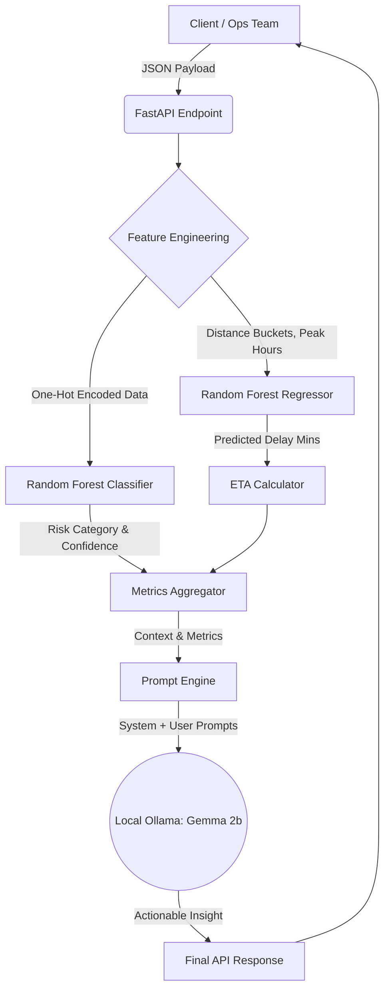

# AI-Powered Freight Shipping Optimization

An end-to-end Machine Learning and AI intelligence pipeline designed to improve logistics efficiency by predicting freight delays, estimating delivery times (ETA), and classifying shipment risks.


## Table of Contents
1. [Problem Statement](#-problem-statement)
2. [System Architecture](#-system-architecture)
3. [Dataset Description](#-dataset-description)
4. [Assumptions & Logic](#-assumptions--logic)
5. [Installation & Setup](#-installation--setup)
6. [API Usage](#-api-usage)

---

## Problem Statement
Freight logistics teams frequently struggle with unexpected delivery delays, route inefficiencies, and poor visibility into shipment risks. 

This project solves this by providing an AI-powered API that ingests real-time shipment parameters and outputs:
* **Precise ETA Prediction** using a Random Forest Regressor.
* **Delay Risk Classification** (On-Time, Moderate, High) using a Random Forest Classifier.
* **Actionable Operational Insights** generated dynamically via a local LLM (Gemma 2b).

---

## System Architecture

The system is built on a modular architecture, separating the core machine learning pipeline from the dynamic AI insight generation.



---

## Dataset Description
Because real-world freight data is proprietary, this project utilizes a custom Python script (`scripts/generate_data.py`) using the `Faker` library to synthesize 2,000 highly realistic shipment records across major Indian logistics hubs (Chennai, Delhi, Mumbai, Bangalore, etc.).

**Key Features:**
* **Geographic Consistency:** Distances between specific city pairs are locked (e.g., Chennai to Delhi is the same distance as Delhi to Chennai for a given mode).
* **Correlated Delays:** The `Delay` target variable is logically driven by the input features. For example, `Traffic: High` and `Weather: Storm` systematically increase the delay minutes, allowing the ML models to learn actual geographic and environmental patterns.

---

## Assumptions & Logic
* **Peak Hours:** Defined as 08:00–11:00 and 17:00–20:00 for feature engineering.
* **Distance Buckets:** Routes are classified as Short (<= 500km), Medium (501–1500km), and Long (> 1500km).
* **Base Travel Speeds:** ETA calculations assume base speeds before predicted delays: Trucks (60 km/h), Rail (40 km/h), and Flights (500 km/h).
* **Risk Thresholds:** Delays under 30 minutes are 'On-Time', 30–120 minutes are 'Moderate', and over 120 minutes are 'High'.

---

## Installation & Setup

### 1. Clone & Install Dependencies
Ensure you have Python 3.9+ installed.
```bash
git clone <your-repo-link>
cd freight-shipping-optimization
pip install -r requirements.txt
```

### 2. Run the Machine Learning Pipeline
Navigate to the `notebooks/` folder and run them in sequence to generate the dataset and train the models:
1.  `01_eda_and_preprocessing.ipynb` EDA,preprocessing,feature_engineering works
2.  `03_model_training.ipynb`  model training & serialization
1.  `04_insights_and_optimization.ipynb` Insights& Optimizations

### 3. Start the Local LLM (Ollama)
This project requires Ollama running locally to generate the operational insights without incurring cloud API costs or sharing proprietary data.
```bash
ollama run gemma:2b
```

### 4. Start the FastAPI Server
In a new terminal window, start the backend application:
```bash
uvicorn app.main:app --reload
```
The API will be live at `http://127.0.0.1:8000`.

---

## API Usage

**Endpoint:** `POST /predict-shipment`

**Sample Request:**
```bash
curl -X 'POST' \
  '[http://127.0.0.1:8000/predict-shipment](http://127.0.0.1:8000/predict-shipment)' \
  -H 'accept: application/json' \
  -H 'Content-Type: application/json' \
  -d '{
  "origin": "Chennai",
  "destination": "Delhi",
  "distance": 2200,
  "mode": "Truck",
  "weather": "Storm",
  "traffic": "High"
}'
```

**Sample Response:**
```json
{
  "eta_hours": 41.5,
  "delay_risk": "High Delay",
  "confidence": 0.88,
  "ai_insight": "Due to the storm and high traffic conditions on this long-haul truck route, expect severe delays exceeding two hours. Reroute if possible, or advise the receiving facility in Delhi to adjust their dock scheduling immediately."
}
```
